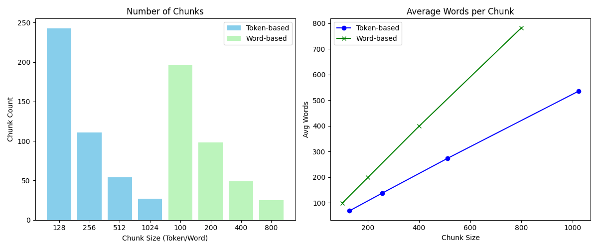
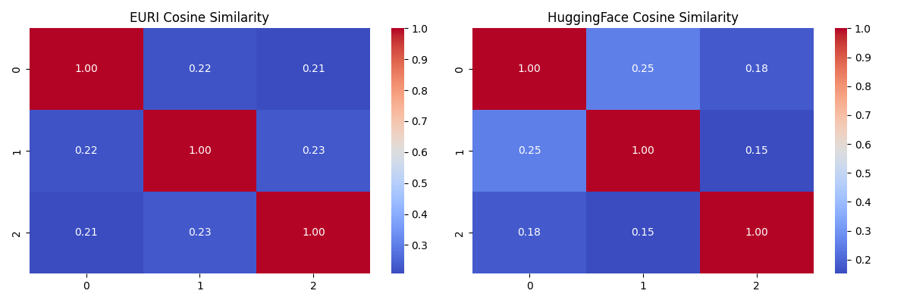

# 📚 Documnet Loading Assignment

- 📄 Loading `.txt`, `.csv`, `.docx`, Notion, and URL content
- ✂️ Chunking with Recursive, Token, and Sentence strategies
- 🧾 Metadata injection and filtering
- 🔬 Token vs Word chunk size analysis
- 📡 Generating embeddings using EURI and HuggingFace
- 🔍 Semantic search using FAISS
- 📈 Visualizations and similarity heatmaps

---

## 📁 Project Structure

```bash
Assignment/
├── generate_test_data.py      # Generate long, realistic test data
├── loaders.py                 # Load various document types
├── chunking.py                # Recursive, token-based, sentence chunking
├── metadata_filter.py         # Add metadata and apply chunk filters
├── text_splitters.py          # Built-in and custom sentence splitters
├── chunk_analysis.py          # Chunk size vs count analysis + charts
├── embeddings.py              # EURI & HuggingFace embeddings + FAISS search
├── main.py                    # Run everything end-to-end
├── README.md                  # You're here
└── test_data/                 # Auto-generated input/output files
````

---

## 🚀 Run the Full Pipeline

```bash
python main.py
```
---

### Chunk Size Comparison



### Embedding Similarity Comparison



---
